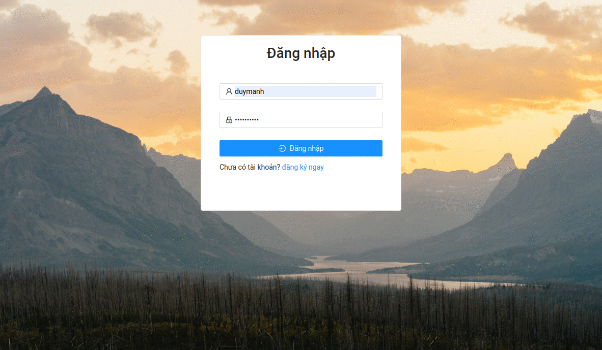
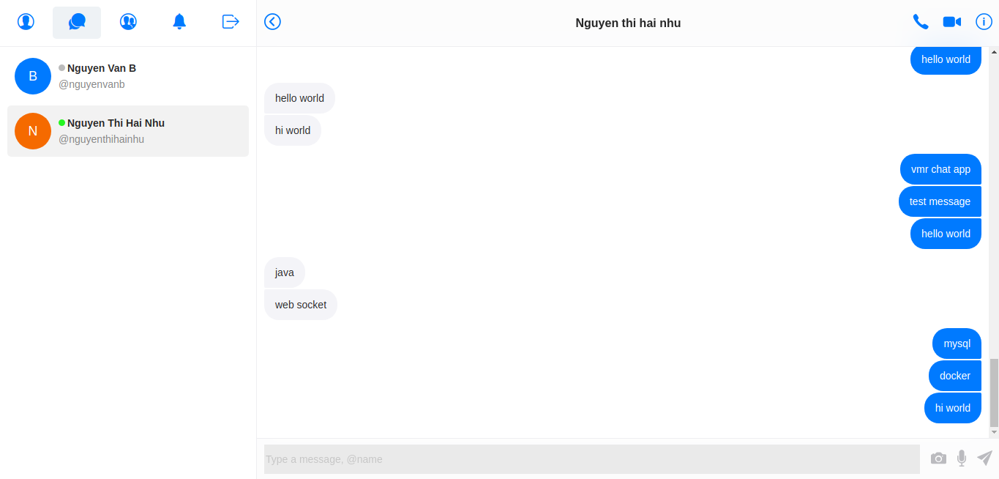
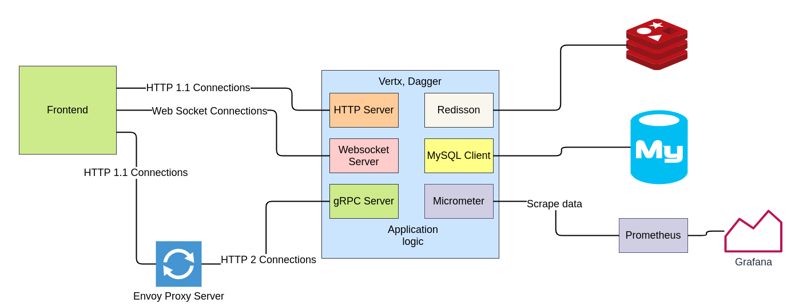

# VMR Chat

- [VMR Chat](#vmr-chat)
  - [1. Tổng quan](#1-tổng-quan)
  - [2. Hướng dẫn chạy](#2-hướng-dẫn-chạy)
  - [3. Demo](#3-demo)
  - [4. Kiến trúc ứng dụng](#4-kiến-trúc-ứng-dụng)
  - [5. Thiết kế](#5-thiết-kế)
  - [6. Slide trình bày](#6-slide-trình-bày)



## 1. Tổng quan

__VMR Chat__ là ứng dụng chat realtime với tính năng cơ bản. Là project thuộc module-10 trong chương trình training fresher của Zalopay.

Ứng dụng có các tính năng sau:

- Đăng ký
- Đăng nhập - đăng xuất sử dụng JWT
- Tìm kiếm bạn bè
- Kết bạn
- Chat 1 - 1
- Hiện trạng thái online của người dùng
- Chuyển tiền
- Xem số dư
- Hiện lịch sử giao dịch
- Giao diện responsive

Các công nghệ sử dụng:

- Java, Vertx framework để xây dựng logic ở backend
- Logging: Log4j2
- Cơ sở dữ liệu: MySQL
- Cache: Redis
- React, Redux, Ant Design để xây dựng giao diện (có sử dụng template)
- Sử dựng Websocket để hiện thực chức năng chat
- gRPC cho API chuyển tiền
- Monitoring: Prometheus - Grafana
- Sử dụng docker để deploy sản phẩm

## 2. Hướng dẫn chạy

Chạy lệnh docker compose (yêu cầu quyền root) tại thư mục `vmr-chatapp`. Cấu hình cần thiết để chạy ứng dụng nằm trong thư mục `vmr-docker`.

```bash
docker-compose up -d
```

## 3. Demo



Chi tiết tại [demo](./report/doc/demo.md)

## 4. Kiến trúc ứng dụng



Chi tiết tại [architechture](./report/doc/architechture.md)

## 5. Thiết kế

- [Mockup](https://balsamiq.cloud/seo701z/pbade9k)
- [GRPC API Design](report/doc/grpc-design.md)
- [Database design](report/doc/database-diagrams.md)
- [HTTP API design](https://app.swaggerhub.com/apis-docs/anhvan1999/vmr-chat/1.0.0)
- [Sequence diagrams](report/doc/sequence-diagrams.md)
- [Cache design](report/doc/cache-design.md)

## 6. Slide trình bày

- Xem chi tiết tại [đây](https://docs.google.com/presentation/d/1U3-c4uA41YDkuKFxvouv5NcHEuowjYQbiQFb-z1BKkw/edit?usp=sharing)
