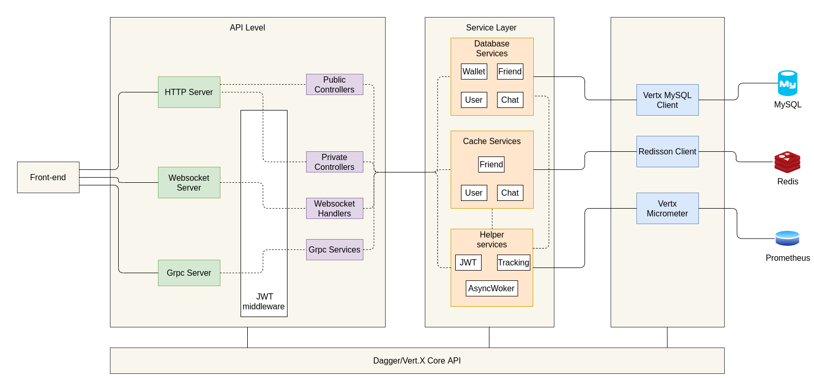
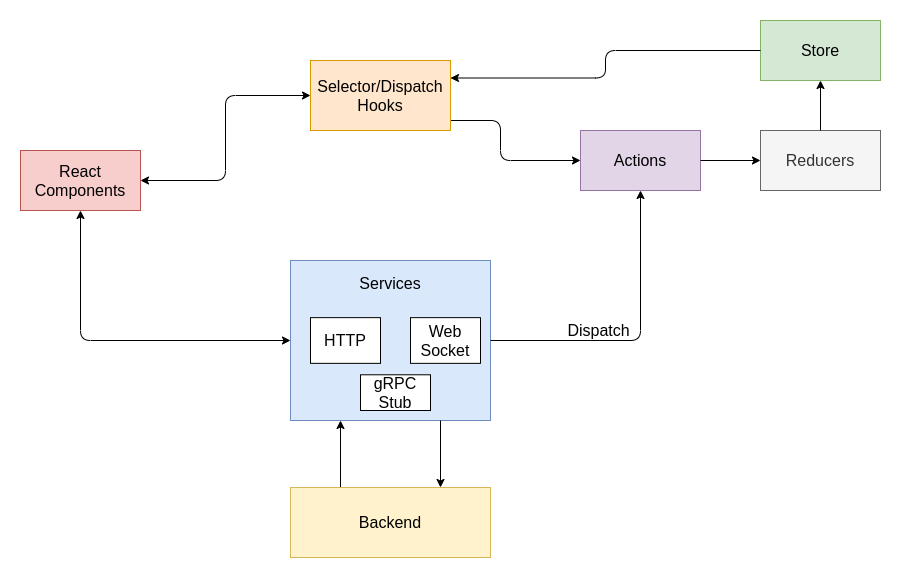

# 4. Kiến trúc ứng dụng

<!-- TOC -->

- [4. Kiến trúc ứng dụng](#4-kiến-trúc-ứng-dụng)
  - [4.1 Kiến trúc tổng thể](#41-kiến-trúc-tổng-thể)
  - [4.2 Backend](#42-backend)
  - [4.3 Frontend](#43-frontend)

<!-- /TOC -->

## 4.1 Kiến trúc tổng thể

## 4.2 Backend

## 4.3 Frontend

