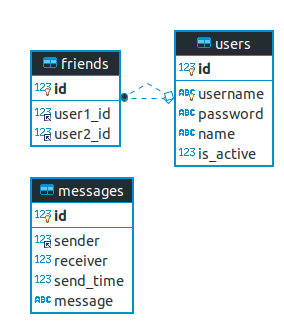
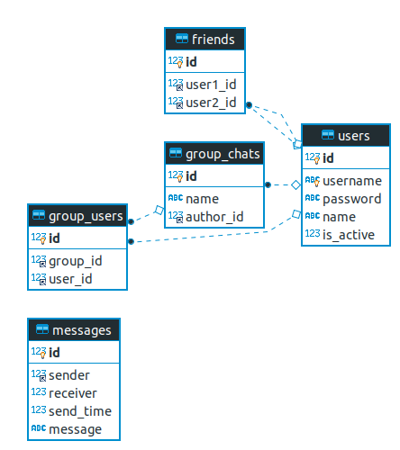

# Database Diagram

## 1. Database diagram

## 2. Hướng mở rộng

### 2.1. Kết bạn

Thêm bảng friends chứa thông tin bạn bè:

### 2.2 Chat group

Thêm bảng `group_chats` và `group_users`

Lúc này trường `receiver` trong bảng `messages` sẽ chứa `id` của `users` hoặc `group`. Ta có thể thêm trường `receiver_type` để phân biệt.
