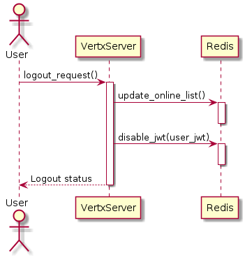
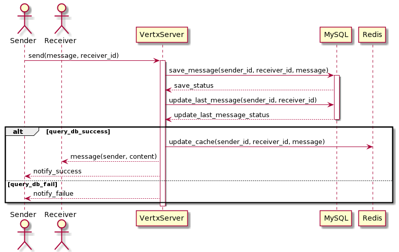
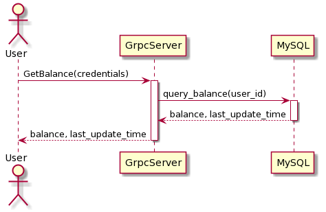
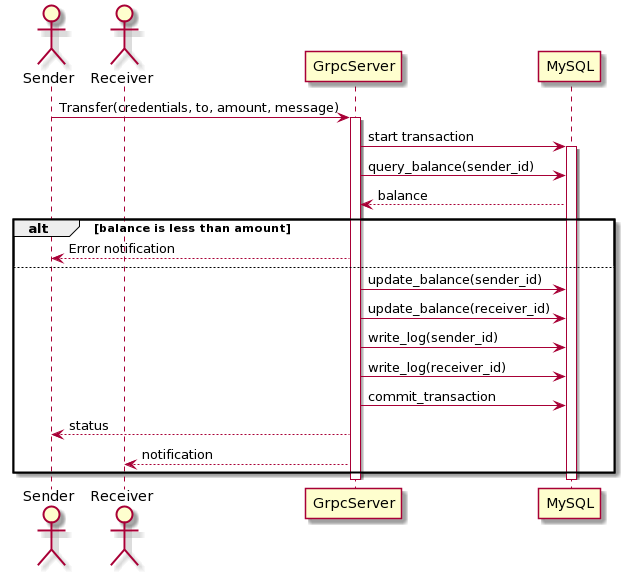
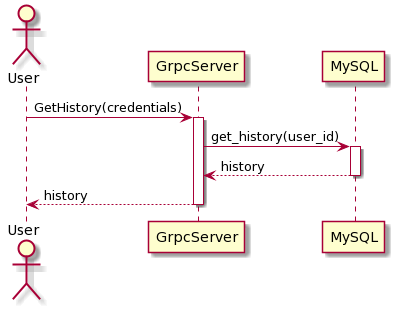
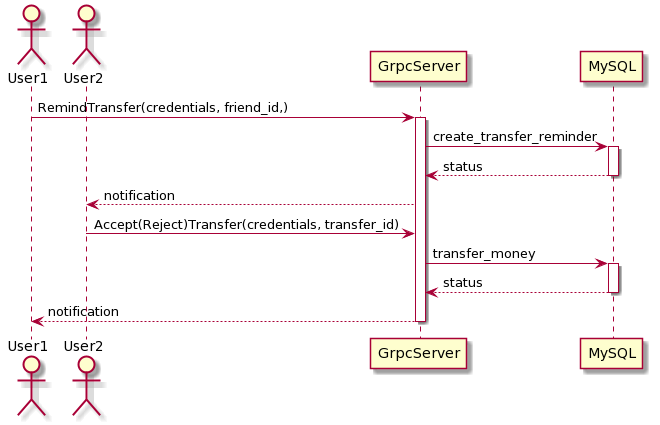

# Sequence diagrams

- [Sequence diagrams](#sequence-diagrams)
  - [1. Đăng ký](#1-đăng-ký)
  - [2. Đăng nhập](#2-đăng-nhập)
  - [3. Đăng xuất](#3-đăng-xuất)
  - [3. Xem danh sách User](#3-xem-danh-sách-user)
  - [4. Chat 1 - 1](#4-chat-1---1)
  - [5. Xem số dư](#5-xem-số-dư)
  - [6. Chuyển tiền](#6-chuyển-tiền)
  - [7. Xem lịch sử](#7-xem-lịch-sử)
  - [8. Nhắc chuyển tiền](#8-nhắc-chuyển-tiền)

## 1. Đăng ký

## 2. Đăng nhập

## 3. Đăng xuất

## 3. Xem danh sách User

## 4. Chat 1 - 1

## 5. Xem số dư

## 6. Chuyển tiền

## 7. Xem lịch sử

## 8. Nhắc chuyển tiền

