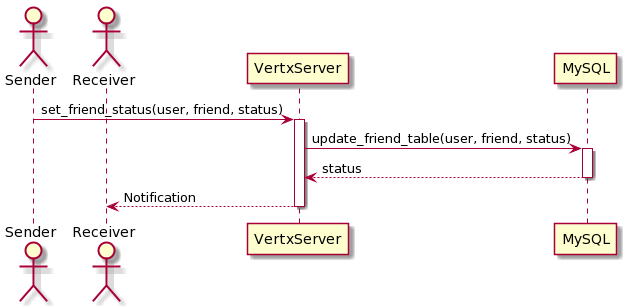

# Sequence diagrams

- [Sequence diagrams](#sequence-diagrams)
  - [1. Đăng ký](#1-đăng-ký)
  - [2. Đăng nhập](#2-đăng-nhập)
  - [3. Đăng xuất](#3-đăng-xuất)
  - [4. Kết bạn/Chấp nhận/Xóa lời mời](#4-kết-bạnchấp-nhậnxóa-lời-mời)
  - [5. Xem danh sách bạn bè](#5-xem-danh-sách-bạn-bè)
  - [6. Chat 1 - 1](#6-chat-1---1)
  - [7. Xem số dư](#7-xem-số-dư)
  - [8. Chuyển tiền](#8-chuyển-tiền)
  - [9. Xem lịch sử](#9-xem-lịch-sử)
  - [10. Nhắc chuyển tiền](#10-nhắc-chuyển-tiền)

## 1. Đăng ký

## 2. Đăng nhập

## 3. Đăng xuất

## 4. Kết bạn/Chấp nhận/Xóa lời mời

## 5. Xem danh sách bạn bè

## 6. Chat 1 - 1

## 7. Xem số dư

## 8. Chuyển tiền

## 9. Xem lịch sử

## 10. Nhắc chuyển tiền

