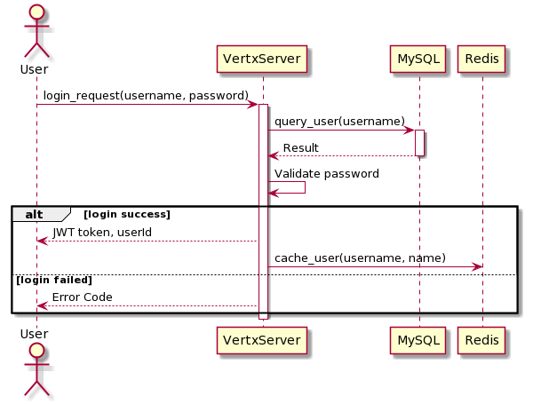
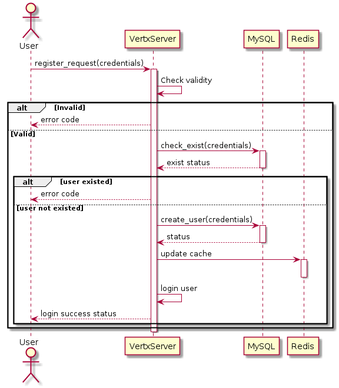
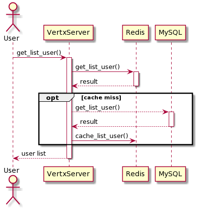
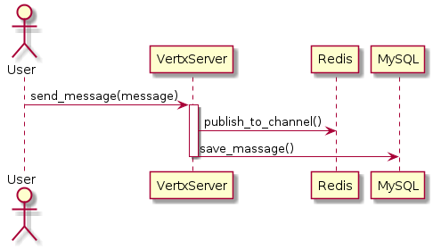
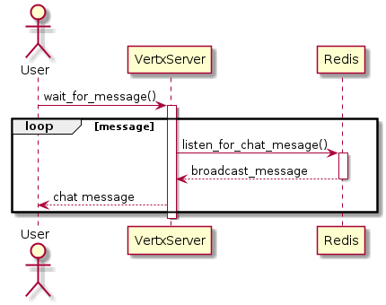
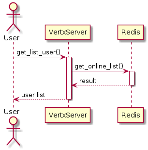
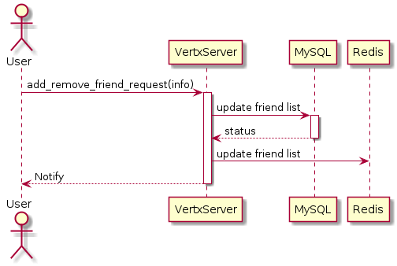
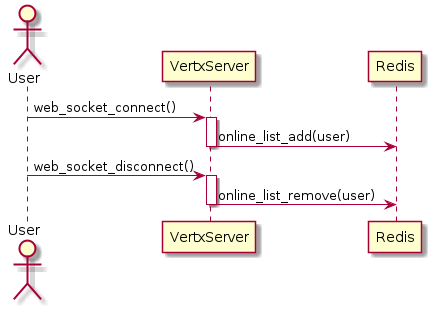

# Sequence diagrams

- [Sequence diagrams](#sequence-diagrams)
  - [1. Login](#1-login)
  - [2. Register](#2-register)
  - [3. View list user in system](#3-view-list-user-in-system)
  - [4. Chat - sender](#4-chat---sender)
  - [5. Chat - receiver](#5-chat---receiver)
  - [6. View user online/offline](#6-view-user-onlineoffline)
  - [7. Add - remove friend](#7-add---remove-friend)
  - [8. Notify when user online - offline](#8-notify-when-user-online---offline)

## 1. Login

## 2. Register

## 3. View list user in system

## 4. Chat - sender

## 5. Chat - receiver

## 6. View user online/offline

## 7. Add - remove friend

## 8. Notify when user online - offline

